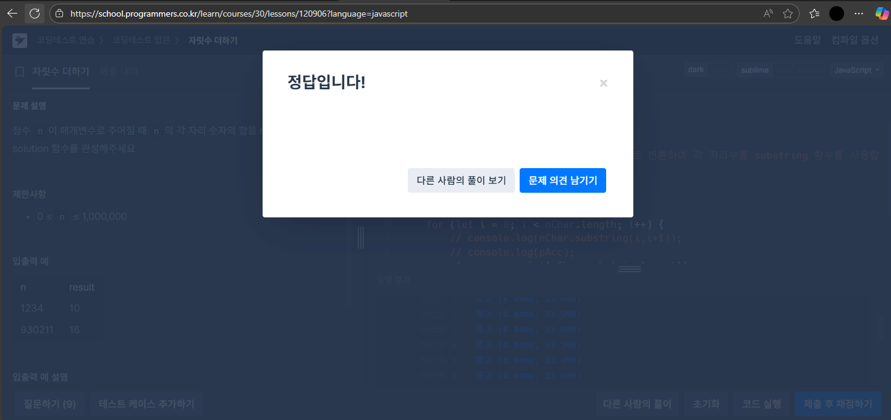
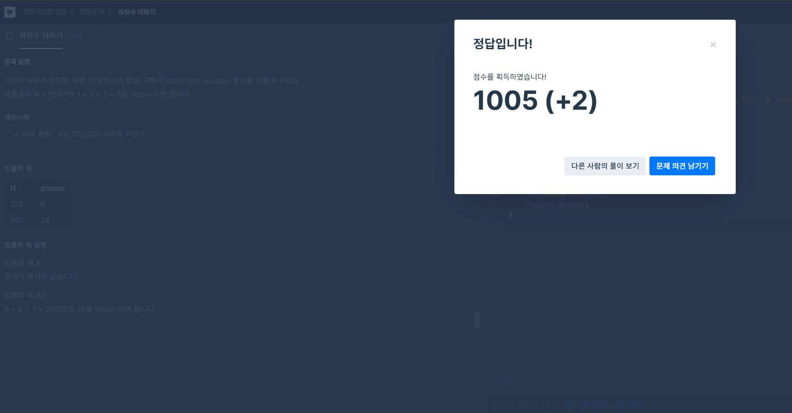

## 프로그래머스에 자릿수 구하기는 검색되지 않고, `자릿수 더하기`가 두가지가 조회되어 둘다 각각 풀려고 했으나
## 둘다 문제의 취지가 동일했고 (문제가 똑같다고 봐도 무방) 스크립트 또한 100% 동일하게 제출하였습니다.

1. 접근
 : 파라미터는 숫자형 변수로 들어오는데, 각 자리수의 변수를 접근하고자 하니 substring 함수가 먼저 생각이 났다.
   하지만 substring은 문자열 변수에 대해서만 사용 가능하므로 
   문자형으로 파싱해서 접근하는 방법도 있지만, `숫자 +""` 방식이 너무 편하므로 일단 그렇게 진행했는데 
   시행착오 없이 그냥 한방에 잘 진행되어버렸다...

2. 막힘
    막히지 않았다.

3. 해결
    결과가 예시대로 잘 나오길래 프로그래머스 사이트에서 작성한 스크립트를 붙혀얺기 하였더니
    `정답입니다!`가 떠서 (1/3) Pass!!