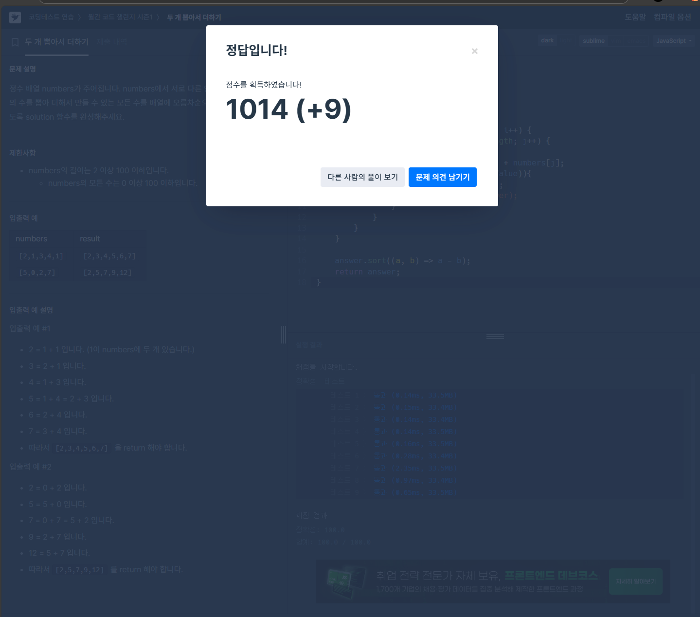

1. 접근: 
        하나의 배열 속 서로 다른 두 인덱스의 두 수를 비교하기 위해서
        이중for문 방식을 채택하였다.

2. 막힘: 
        처음엔 배열 내 동일한 인덱스 두개를 합쳐도 되는 줄 알고 진행했다가 
        정답과 다른 것을 보고 문제를 다시 보니 서로 다른 인덱스의 두 수를 뽑아야 하는 것을 확인하고
        이중 for문 안에 if ( i != j) 조건을 추가하였다. (문제를 잘 파악하자! 요구사항 명세를 잘 읽자!!)

3. 해결: 
    마지막으로 오름차순 정렬을 해야하는데 
    가장 간단한 코드를 고민하다가 인터넷 검색을 좀 했습니다. (유일하게 외부 참조한 코드!!)
    `answer.sort((a, b) => a - b); //오름차순 정렬`
    까먹지 않겠습니다. `__)`;
