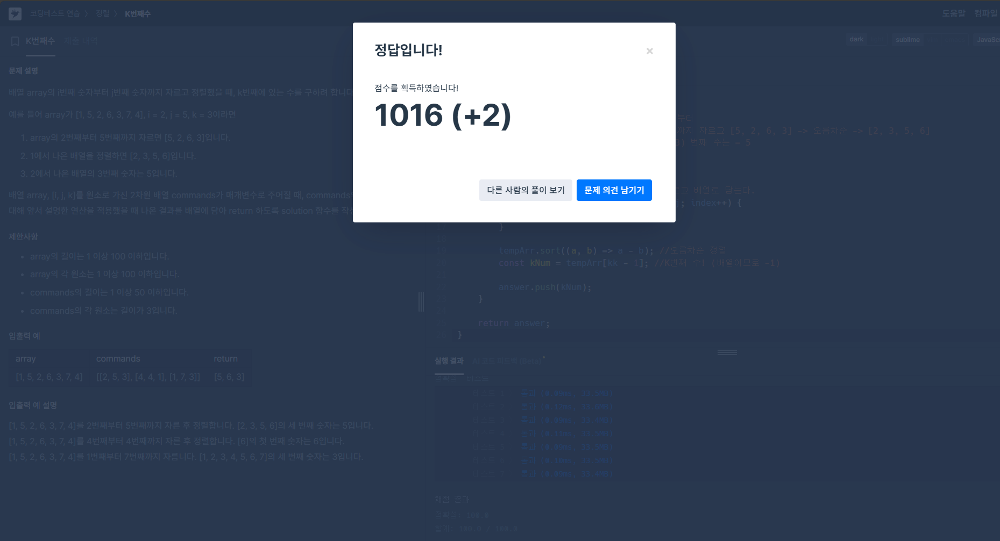

1. 접근:

    문제를 이해하는것이 어려워서 문제를 읽는고 이해하는데 시간이 한참 걸렸다.
    간단히 말해서 기준 배열에 대해서 i번째 부터 j까지 잘라서 오름차순 후 k번째 수를 구하는 문제였다. 
    **[기준배열], [i,j,k], [k번째값]**
    이번 문제는 코드가 어렵다기 보다는 문제를 이해하고 코드로 풀어나가는 과정이 어려운 문제였다.
    예시로 준 입출력을 변수에 대입해보면서 차근차근 작성 해 나갔다.

2. 막힘:

    막혔다라기 보단.. 몇번째 ~ 몇번째, 마지막으로 k번째도 결국 배열의 인덱스가 0부터 시작한다는 것에 대해 
    매번 -1을해야 정확한 수를 도출해 낼 수 있다는 점을 잘 이해해야 해결할 수 있는 문제라는 생각이 들었다.

3. 해결:

    k번재 수를 구하기전에 오름차순 정렬을 해야했는데 코딩테스트 2/3번째 문제에서 오름차순 함수를 이미 사용했던 터라
    빠르게 재사용하므로서 최종 해결되면서 오름차순 함수 체화에 도움이 되었음!
